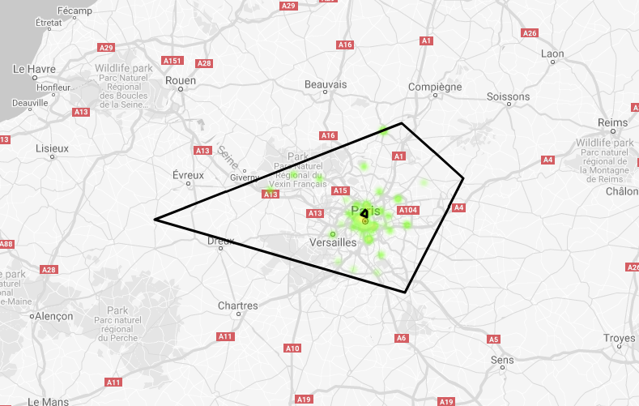

# big-query-location-data-prototype
A Big Query project that displays location data on a map and uses SQL queries, user defined functions and the BigQuery API

Requirements:
- Clone this repo.
- Create some Google credentials and insert them in the clienID and Key fields of the code (YOUR_MAPS_KEY, YOUR_CLIENT_ID)
- Create or select a project on Google Cloud Platform.
- Deploy app.yaml with: gcloud app deploy app.yaml --project PROJECT-NAME --version VERSION-NAME
- Enjoy!

Results: you will get your input rendered automatically by Google JS Maps and sent to the BigQuery API backend.

Testing it:
https://location-geodb.appspot.com/
